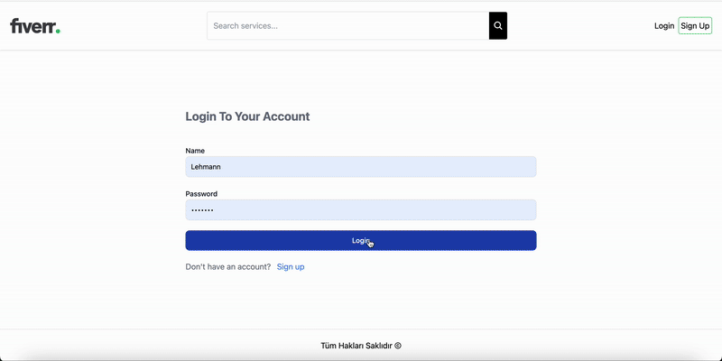
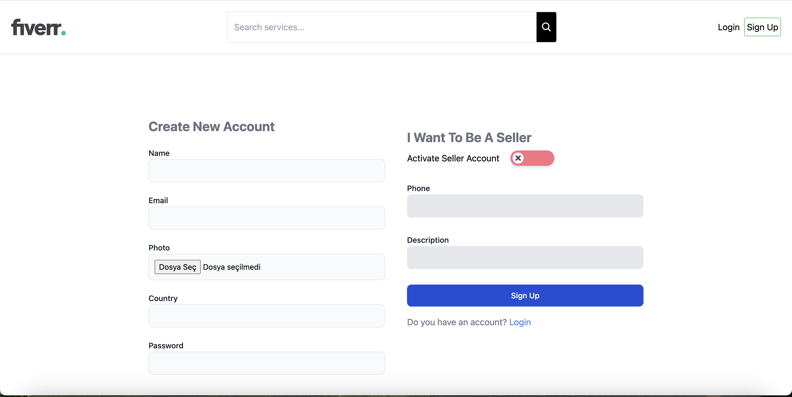
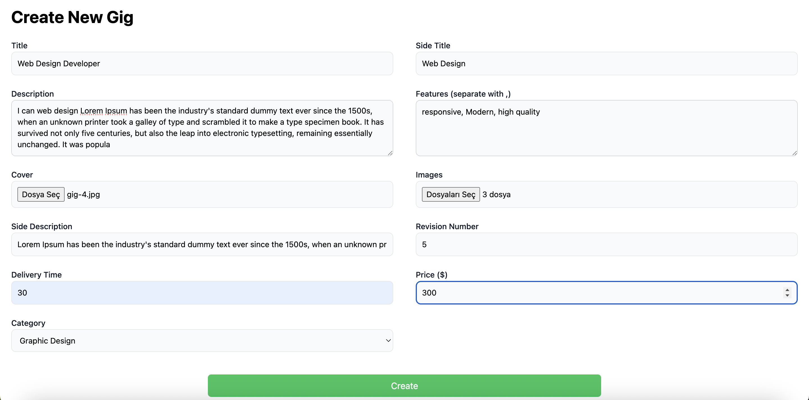

# 🎯 Fiver FS Projesi

Bu proje, **satıcı–alıcı etkileşimli** bir platform örneğidir.  
Kullanıcılar hesap açabilir, satıcılar gig oluşturabilir ve giglere yorum / değerlendirme yapabilirler.

---

## 🚀 Kullanılan Kütüphaneler

### Backend

- **express** → routing
- **mongoose** → MongoDB
- **nodemon** → otomatik restart
- **bcrypt** → şifreleme
- **cookie-parser** → cookie üzerinden auth/JWT
- **jsonwebtoken** → JWT oluşturma & doğrulama
- **dotenv** → ortam değişkenleri
- **morgan** → istek loglama
- **cors** → CORS yönetimi
- **multer** → dosya yükleme (frontend → backend)
- **cloudinary** → görseller için bulut depolama

### Frontend

- **react**
- **react-icons** → ikonlar
- **react-router-dom** → sayfalama
- **react-toastify** → bildirimler
- **moment** → tarih/zaman formatlama
- **axios** → API istekleri
- **react-query** → istek cache & state yönetimi
- **tailwindcss** → stillendirme
- **Context API** → global state
- **splide** → fotoğraf slider

---

## ⚡ Özellikler

- Login / Register / Logout
- Giriş yapmadan uygulamayı gezinebilme
- Kayıt olurken **Satıcı** toggle’ı → **phone** ve **description** alanları aktif
- **Sadece satıcı** hesaplar gig oluşturabilir
- Kullanıcı **kendi** gig’ine yorum / değerlendirme yapamaz
- Giglerde:
  - ⭐ Yorum yapma
  - ⭐ Yıldız verme
  - 🗑️ Yorumu silme
- Gig eklerken:
  - **1 adet cover**
  - **Birden fazla image**
- Kategori bazlı listeleme
- Gig adına göre arama

---

## 📝 Notlar

- `require` yerine **ESM import** kullanıldı
- **Hata middleware’i** ile tekrarlar azaltıldı
- Toggle için **uiverse** (ekstra yükleme gerekmez)
- State yönetimi → **Context API**
- Dosya yükleme/erişim → **multer** + **cloudinary**
- **Proje responsive’dir** (mobil, tablet, desktop ekranlarda uyumlu çalışır)

---

## 📸 Ekran Görüntüleri & GIF

> Görseller büyük boyutta gösterilir; dar ekranlarda **otomatik küçülür (responsive)**.

  

 

  

 

  

